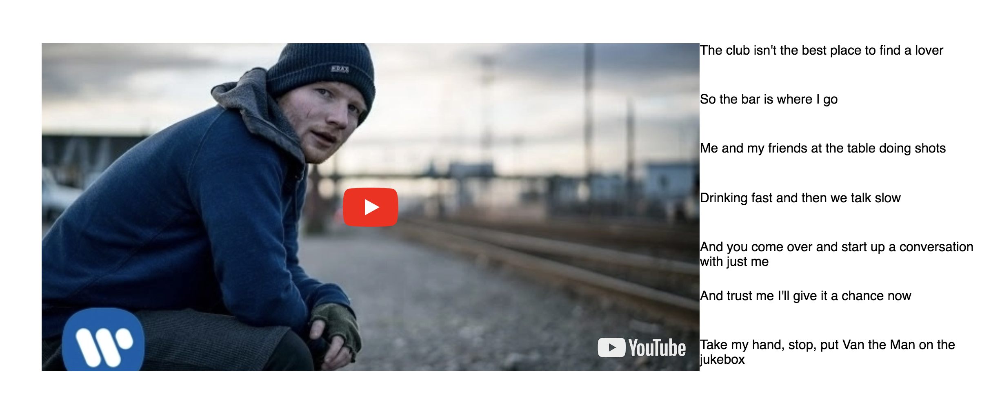
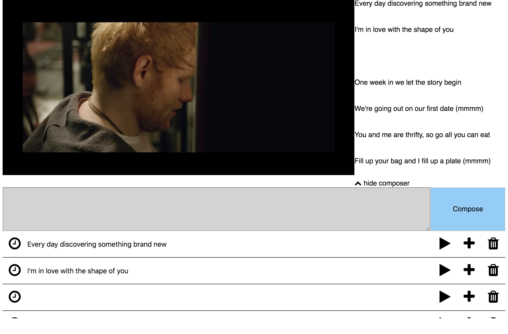

# The edx-like player

## How to use:
1. Change the url props in src/App.js
2. Change the lyrics in constant/lyrics
3. You can make your own lyrics fetch API if need

## Application
1. In playing mode
.
2. In compsing lyric mode
.

## Reference
1. [react](https://reactjs.org).
2. [redux](https://redux.js.org).
3. [react-player](https://github.com/CookPete/react-player).
